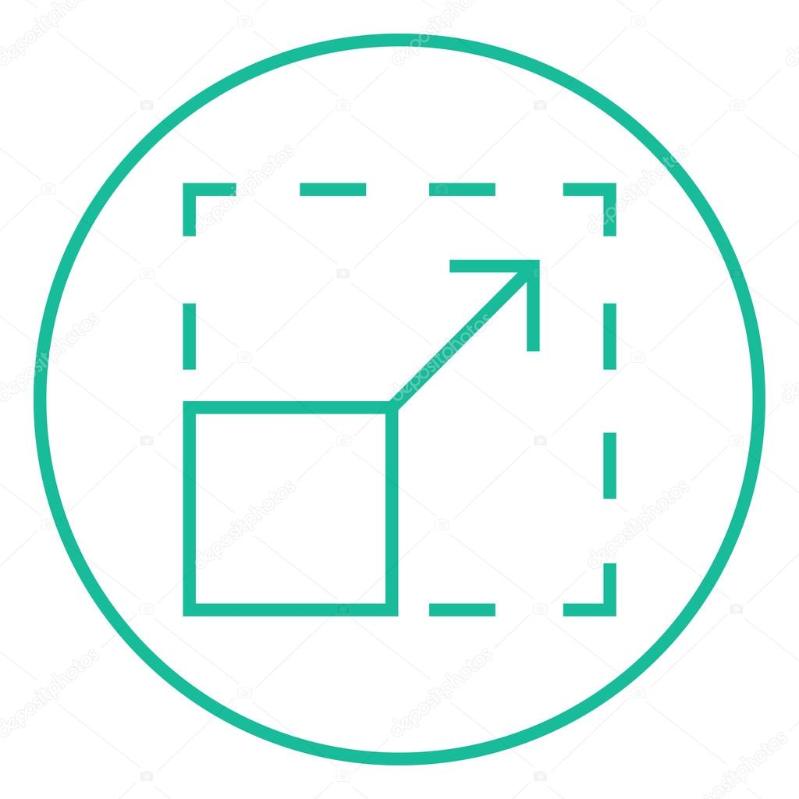
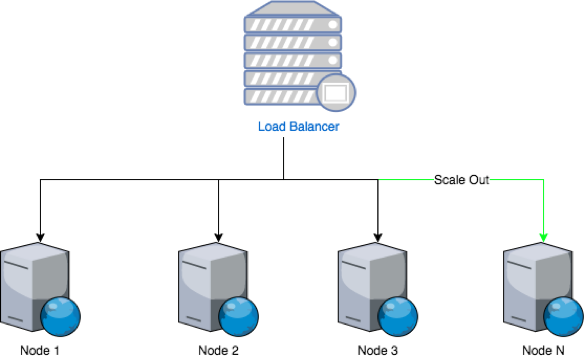
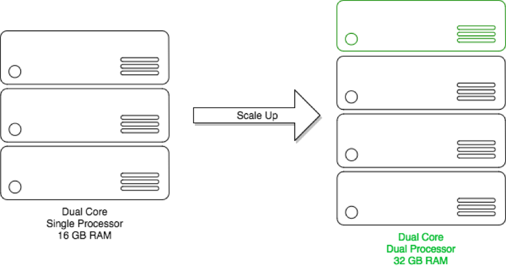
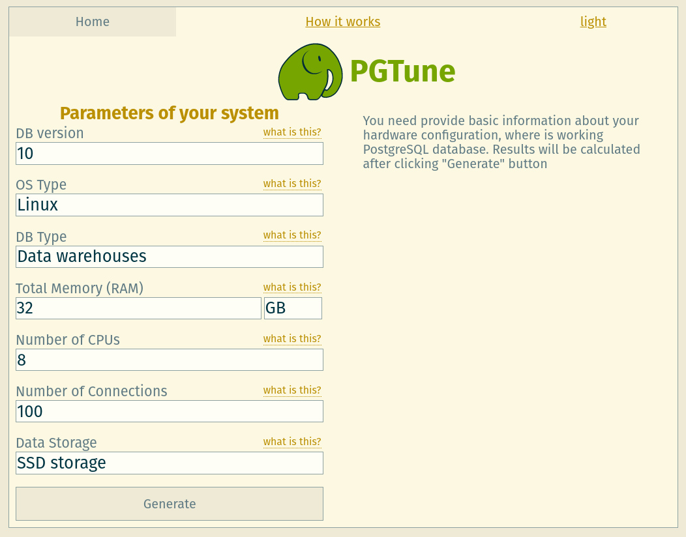
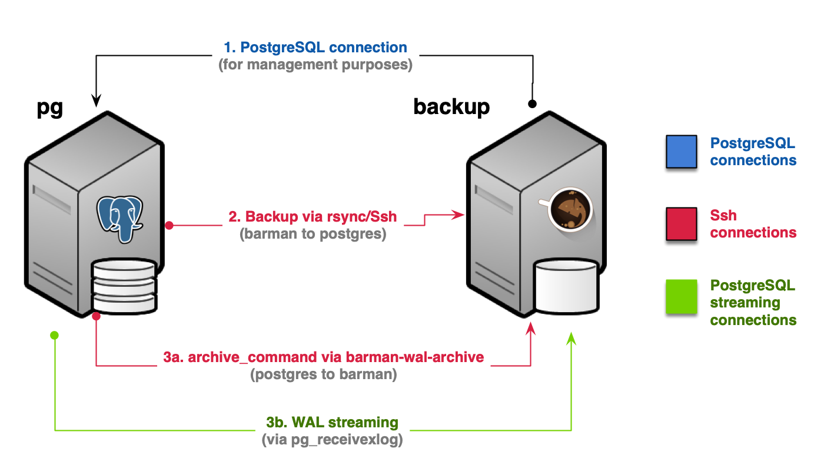
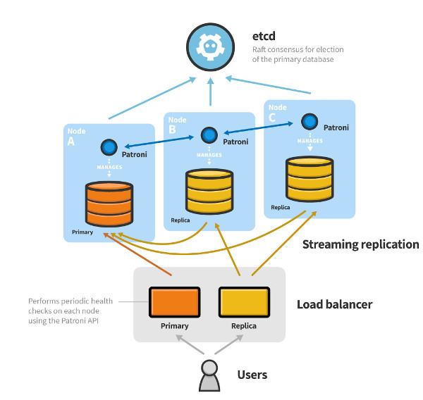
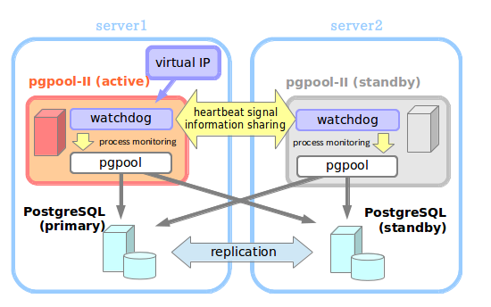

---?color=solid(white)
@title[Developing HA/HP Geospatial Web Service using OSS]

@snap[center text-blue text-15]
Developing High Available/High Performance Geospatial Web Service using Open Source Software
@snapend

@snap[south]
Firman Hadi
firman@indotechsa.com
@snapend

@snap[north-east span-25]

@snapend

@snap[north-west span-8]

@snapend

---?color=black

@snap[west span-45]
## Digital service strategy
@snapend

@snap[north-east span-60]
@box[bg-purple text-white](One#the who, what, when, and where)
@snapend

@snap[east span-60]
@box[bg-orange text-white](Two#*listening* and *responding* to consumers )
@snapend

@snap[south-east span-60]
@box[bg-pink text-white](Three#to have **excellent service** to the consumer)
@snapend

---?color=linear-gradient(180deg, white 40%, black 60%)
@title[The importance of digital service]
@snap[north-west span-90]
## The importance of digital service
@snapend

@snap[south span-100 text-white]
Out of 1,000 business decision makers, 98% agree the delivery of digital services and apps is critical to a successful company, but 95% encounter challenges in implementation.
@snapend

---?image=assets/img/goal.jpg&position=center&size=45% 40%

@title[Goal]

@snap[south span-80]
@box[bg-purple text-white](Goal#to have **excellent** Geospatial Web Service)
@snapend

---?color=linear-gradient(90deg, black 75%, white 25%)
@title[Measures of success]

@snap[north-west h3-white]
### Measures of success
@snapend

@snap[west span-55]
@ul[list-spaced-bullets text-white text-09]
- improved user experience and satisfaction (53%)
- greater market agility (49%)
- **faster time to market** (48%)
@ulend
@snapend

@snap[east span-45][Test]
@img[shadow](assets/img/goal.jpg)
@snapend

---?color=linear-gradient(270deg, black 65%, white 35%)
@title[Challenges on digital service]

@snap[north-east h3-white]
### Barriers
@snapend

@snap[east span-55]
@ul[list-spaced-bullets text-white text-09]
- Budget (51%)
- **Complex** or **rigid** legacy IT infrastructure (45%)
- Lack of **appropriately-skilled** personnel (39%)
@ulend
@snapend

@snap[west span-45][Test]
@img[shadow](assets/img/fence.jpg)
@snapend
---

## Terms

---?color=linear-gradient(180deg, white 50%, black 50%)
@title[High availability]
@snap[north-west span-50]
## High availability
@snapend

@snap[north-east span-35]

@snapend

@snap[south span-100 text-white]
Think of high availability as a system design or methodology that can satisfy specific—and contractual—uptime performance goals. High-availability solutions minimize downtime and maximize availability.
@snapend

---?color=linear-gradient(180deg, white 60%, black 40%)
@title[Scalability]
@snap[north-center span-50]
## Scalability
@snapend

@snap[north-east span-35]

@snapend

@snap[south span-100 text-white]
System's capability to handle bigger amounts of work, or to be easily expanded, when there is an increase demand for network, processing, database access or file system resources.
@snapend

---?color=linear-gradient(180deg, white 60%, black 40%)
@snap[north-center span-50]
## Horizontal
@snapend

@snap[north-east span-50]

@snapend

@snap[south span-100 text-white]
A system scales horizontally, or out, when it's expanded by adding new nodes with identical functionality to existing ones, redistributing the load among all of them.
@snapend

---?color=linear-gradient(180deg, white 60%, purple 40%)
@snap[north-center span-40]
## Vertical
@snapend

@snap[north-east span-60]

@snapend

@snap[south span-100 text-white]
A system scales vertically, or up, by adding more processors, main memory, storage, or network interfaces to a node to handle more requests per system. 
@snapend

---

@title[PostgreSQL tuning]

## Tuning PostgreSQL

---

@snap[north-east span-80 text-06 text-gray]
Tune your PostgreSQL at https://pgtune.leopard.in.ua/
@snapend

@code[http zoom-7](assets/src/pgtune.http)

@snap[south span-100 text-08]
@[1-7,zoom-16](<h2>Server specifications</h2>)
@[9-13,zoom-16]()
@snapend

---
### pgbarman
@fa[quote-left](Backup Manager)

---
### patroni

---
### pgpool-II

---?image=assets/img/bcp2.png&position=center&size=70% 70%
@snap[north]
## Study case
@snapend

---?video=assets/vid/ha_pg_patroni.mp4
@title[Automatic failover with Patroni]

---

@css[title-top-right](Backup)

---?video=assets/vid/pooling_mechanism_poc_v1.m4v
@title[Pooling mechanism I]

---?video=assets/vid/pooling_mechanism_poc_v2.m4v
@title[Pooling mechanism II]

---?video=assets/vid/replication_failover_poc_v1.m4v
@title[Failover mechanism with repmgr]

---?image=assets/img/presenter.jpg

@snap[north span-100 h2-white]
## Any question?
@snapend
